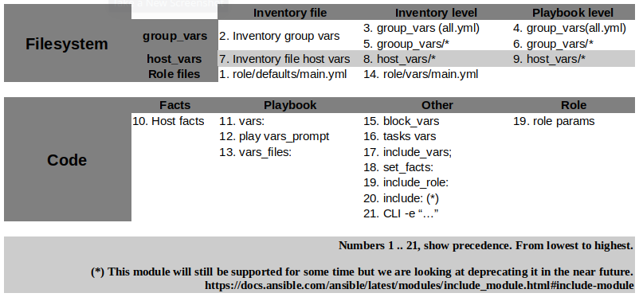

The crucial part of Ansible is variables.  One of the dubious thing of Ansible is that it offers too much freedom. This has advantages and disadvantages. A disadvantage would be the complexity along with high responsibility. In its turn, an advantage, would be flexibility. Therefore let's revise what we know about variables and try to arrange the information, make it simpler.  
Variables could be grouped into two categories:
* variables on filesystem
* variables in code

Now if we look at variables' precedence it suddenly makes perfect sense.



"File system" variables have lower precedence compared to "code" variables. Have you noticed that flexibility and excessive freedom mentioned above?

Keeping in mind what we know about variables we can start using this knowledge.

1. The best place for variables is the file system (Inventory, goup_vars, host_vars, role/defaults/main.yml and role/vars/main.yml). All "Permanent" variables have to be defined within the file system and must be explicit. Permanent means variables that affect the role or the playbook behaviour.  As opposed to "temporary" variables which are used as a buffer, a temporary place for values, usually they are scoped. For instance block vars. They are exist inside block only.
Example:

```
- name: Variables scope
  hosts: localhost
  connection: local
  vars:
    MY_VAR: "I am global var"
  tasks:
    - block:
      - name: Print variable inside the block.
        debug:
          var: MY_VAR
        vars:
          MY_VAR: "I am local var"

- name: Print variable outside the block.
  debug:
    var: MY_VAR
```

```
PLAY [Variables scope]
  TASK [Gathering Facts]
  ok: [localhost]

  TASK [Print variable inside the block.]
  ok: [localhost] => {
  "MY_VAR": "I am local var"
  }

  TASK [Print variable outside the block.]
  ok: [localhost] => {
  "MY_VAR": "I am glozal var"
  }
```
In conclusion. We should define variables within file system. 100% of variables must be defined explicitly. In a role, you have a defaults/main.yml file. Values in this file will have the lowest precedence, so put variable here even if it is empty. It will make contributors life easier, in particular for those who see the code for the first time.

   2. If the role uses many different variables, may be they even implement sophisticated logic, try to describe them in the README file. **ansible-galaxy init** generates a README template for your convenience. When you clone the code from git and it is something completely new for you, you probably expect to see sufficient information in order to understand what the role use as the input and what will be the output just by reading the README file and the code.
     An example of a bad practice would be when code and description are separated, for instance code is in git, description is on the wiki page. There is no guarantee that contributors update both, code and the wiki page. Usually work ends in git PR.

3. All "permanent" ("permanent" variables mentioned in the first advice) variables have to be prefixed. The best practice is using name of the role as the prefix for variables. The reason why we do this could be the situation when we need to place variables for different roles in one place. Like playbook which calls multiple roles. What will happen if all roles have variable **port** for instance? By adding prefix we ensure that variables will not be overwritten by other variables.
Example:
                role = consul.
                variable = consul_url.
                <PREFIX>_<VARIBALE-NAME>

4. Tasks in ansible have names. Use meaningful names, otherwise the string fed to ‘action’ will be used for output. Remember. The output is your log. You may want to read the log in case something went wrong.
Example:

```
# No name/description
- copy: dest=/tmp/text.txt, content="bla-bla"

- name: Print variable global var.
  debug:
    var: MY_VAR
```

```
TASK [copy]
changed: [localhost]

TASK [Print variable global var.] *
ok: [localhost] => {
"MY_VAR": "I am global var"
}
```

5. DRY (Don't Repeat Yourself). Ansible resembles normal programming language. Like normal language, ansible has different mechanisms to help you be DRY. But it requires that you plan your code in advance. When writing the code think how you can make it reusable.  
Big blocks:

| name | URL |
|------|-----|
| import_playbook | https://docs.ansible.com/ansible/latest/modules/import_playbook_module.html#import-playbook-module|
| import_role | https://docs.ansible.com/ansible/latest/modules/import_role_module.html#import-role-module |
| include_role | https://docs.ansible.com/ansible/latest/modules/include_role_module.html#include-role-module |
| import_tasks | https://docs.ansible.com/ansible/latest/modules/import_tasks_module.html#import-tasks-module |
| include_tasks | https://docs.ansible.com/ansible/latest/modules/include_tasks_module.html#include-tasks-module |

 #### Small blocks:  
 Blocks within a role. (include/import)_tasks, (include/import)_role. How it works. Imagine a situation you use **uri** module for sending API requests. Let's say it is POST requests. Instead of repeating uri 10 times with all settings we can create, sort of, method and use it anywhere. As with method in normal programming language, our method also accepts input parameters.  
Example:

send_post.yml
```
- name: .::::::::::::. [ Sent POST request ] .::::::::::::.
  uri:
    url: "{{ URL }}"
    method: POST
    status_code: 200
    body: "{{ BODY_VAR | to_nice_json }}"
    body_format: json
    validate_certs: no
    client_cert: files/tls.crt
    client_key: files/tls.key
    register: return_values
  when: BODY_VAR is defined
```

This is reusable code. Now we can call it any time we want.

```
- name: Bla-bla
    include_tasks: send_post.yml
    vars:
        URL: "{{ main_url }}/{{ item }}"
        BODY_VAR: "{{ item }}"
```
URL and BODY_VAR are method parameters.

6. Use blocks. https://docs.ansible.com/ansible/latest/user_guide/playbooks_blocks.html Apply tasks options only once by grouping them. Also block can be used as try/catch block in traditional programming language. A scenario when it could be useful. At the end of execution you may need to run code no matter what. For example some files need to be deleted even if play fails.
```
  - block:
    - name: .....
    - name: .....
    - name: .....
   always:
      file:
          path: /tmp/xxxx
           state: absent
```

7. The most common best practice is try not to use command and shell modules. It is because these modules are not idempotent. Several approaches help to mitigate the problem. Use:   
**when** condition  
**creates** (If it already exists, this step won't be run.)  
**removes** (If it already exists, this step will be run.).  
**changed_when:**  
Nevertheless just stay away from command and shell **IF** it is possible.

8. Do not use tags. Tags could be a nightmare for people who are getting to know your code. Tag combination multiplies the number of possible playbook scenarios. But if you have no choice describe tags and its combination in the README file with great diligence. However not all tags so bad. There are exceptions.
**always**, **never** - https://docs.ansible.com/ansible/latest/user_guide/playbooks_tags.html#sts=Special%20Tags%C2%B6  
**skip_ansible_lint** - skip ansible-lint for the task.

9. Use least privileges rule. **become** must be **no** unless it is absolutely necessary. Always use become explicitly. For example:

```
  ---

  - hosts: wordpress
     become: no
      ...
     role:
       - role: wordpress
```

tasks/main.yml

```
 ---

- name: Install mysql-server pkg
  apt:
    name: mysql-server
    state: present
  become: yes
```

10. Use YAML instead of inline syntax.
Compare these two syntax types:  

YAML
```
- name: Install apache httpd
  apt:
    name: apache2
    state: present
```

Inline
```
- name: Install apache httpd
  apt: pkg=apache2 state=pesent
```

11. Add .gitignore to your roles if you are going to commit it to git repo.
The most basic lines in the .gitignore file

```
*.retry
*/__pycache__
*.pyc
*.log

### IntelliJ IDEA ###
.idea
*.iws
*.iml
*.ipr
```

12. Use advices regarding content organisation from official ansible page https://docs.ansible.com/ansible/latest/user_guide/playbooks_best_practices.html#content-organization

13. Use dedicated directory for community roles within roles directory from previous advice
